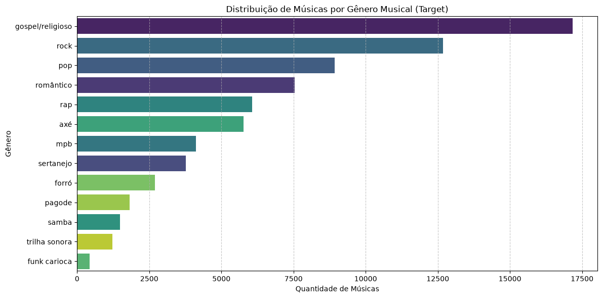
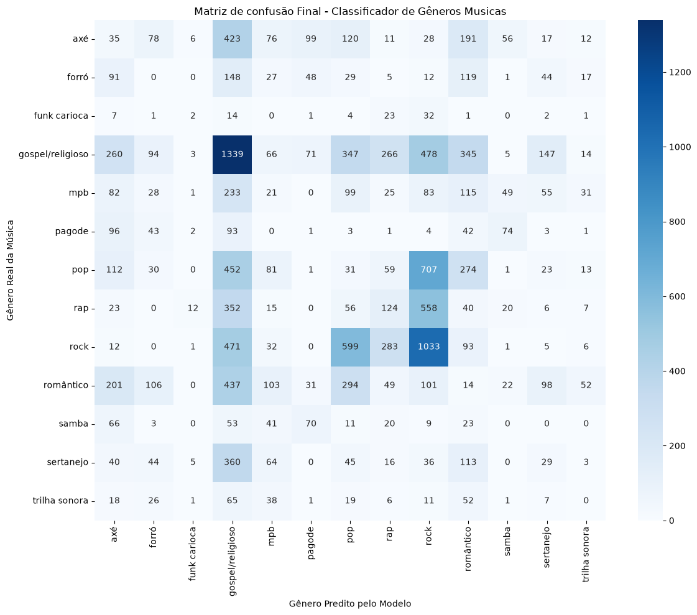

# Classificador de Gêneros Musicais Brasileiros via NLP
Este repositório contém o desenvolvimento do **MVP (Minimum Viable Product) de Machine Learning & Analytics** para a _Pós-Graduação em Ciência de Dados e Analytics_ da **PUC-Rio**.

O projeto propõe a classificação multiclasse de 13 gêneros da música brasileira utilizando uma abordagem híbrida focada em **Processamento de Linguagem Natural (NLP)**. O algoritmo aprende a classificar as faixas analisando exclusivamente as pontuações emocionais líricas (`Raiva`, `Medo`, `Alegria`, `Tristeza` e `Surpresa`) extraídas das letras das músicas.

## Objetivo
Construir, treinar e otimizar um classificador supervisionado capaz de mapear a carga emocional das composições para prever o seu gênero musical, lidando com os desafios inerentes de sobreposição semântica e alto desbalanceamento de classes no cenário fonográfico brasileiro.

## O Dataset
- **Volume:** 73.687 registros (músicas) e 11 atributos.
- **Integridade:** 100% de dados preenchidos (sem valores nulos).
- **Target:** A variável categórica `Gênero`.
- **Desafio Técnico:** Desbalanceamento agudo. A classe majoritária (`gospel/religioso`) representa 23.3% dos dados, enquanto classes minoritárias como `funk carioca` representam menos de 0.6%.

*(Abaixo, a visualização gráfica gerada na Análise Exploratória evidenciando o forte desbalanceamento de classes que justificou a aplicação de divisão estratificada no projeto):*

## Créditos e Autoria dos Dados
*"Se vi mais longe, foi por estar sobre ombros de gigantes."* — **Isaac Newton**

Os dados utilizados neste projeto pertencem ao **"Conjunto de Dados de Séries Temporais de Músicas Brasileiras"** e foram utilizados de acordo com a licença **Attribution 4.0 International (CC BY 4.0)**.

**Todos os créditos** relativos à **extração do Spotify**, **processamento de NLP (BERT/GPT)** e **disponibilização original** pertencem aos seus **respectivos autores**:
- **Autores:** ***Rubio Torres Castro Viana*** e ***Mirella Moro***.
- **Fonte:** Repositório Zenodo (2024).
- **DOI Oficial:** [10.5281/zenodo.12733931](https://doi.org/10.5281/zenodo.12733931)

## Arquitetura e Pipeline de Machine Learning
1. **Preparação de Dados:** Remoção de variáveis sem variância (constantes) e exclusão de identificadores textuais brutos para evitar o memorização de dados.
2. **Prevenção de Data Leakage:** Divisão estrita de dados (_80% Treino_ / _20% Teste_) aplicando técnica de **estratificação** para preservar a distribuição das classes raras.
3. **Avaliação Baseline:** Criação de um modelo ingênuo (`DummyClassifier`) visando chutar a classe majoritária, estabelecendo o _F1-Score Macro_ mínimo aceitável de **0.03**.
4. **Validação Cruzada (CV):** Comparação justa entre os algoritmos `LogisticRegression` e `RandomForestClassifier` com 5 _Folds_.
5. **Otimização de Hiperparâmetros:** Refinamento do modelo vencedor (_Random Forest_) utilizando `GridSearchCV` focando na variação de profundidade das árvores e número de estimadores.

## Resultados
O uso de _Random Forest_ tunado capturou as interações não-lineares das emoções e superou o Baseline em quase 300%.
- **_F1-Score Macro (Baseline)_:** 0.0300
- **_F1-Score Macro (Regressão Logística)_:** 0.0563
- **_F1-Score Macro (Random Forest Otimizado)_:** **0.0800**

A análise da Matriz **confirmou** que *gêneros com identidades líricas muito fortes (**Rock** e **Gospel**) são fáceis do modelo identificar e separar dos demais*, enquanto gêneros que falam sobre **temas parecidos** (**Pop** e **Romântico**) acabam **confundindo o algoritmo**.

## Como Executar
O código foi inteiramente projetado com foco em **reprodutibilidade**.
1. Abra o arquivo Jupyter Notebook do projeto.
2. Os dados serão extraídos dinamicamente de forma bruta (`raw`) do GitHub através do framework Pandas.
3. Execute as células sequencialmente (`Run All`) para reproduzir as métricas estatísticas e gráficos originais do relatório.